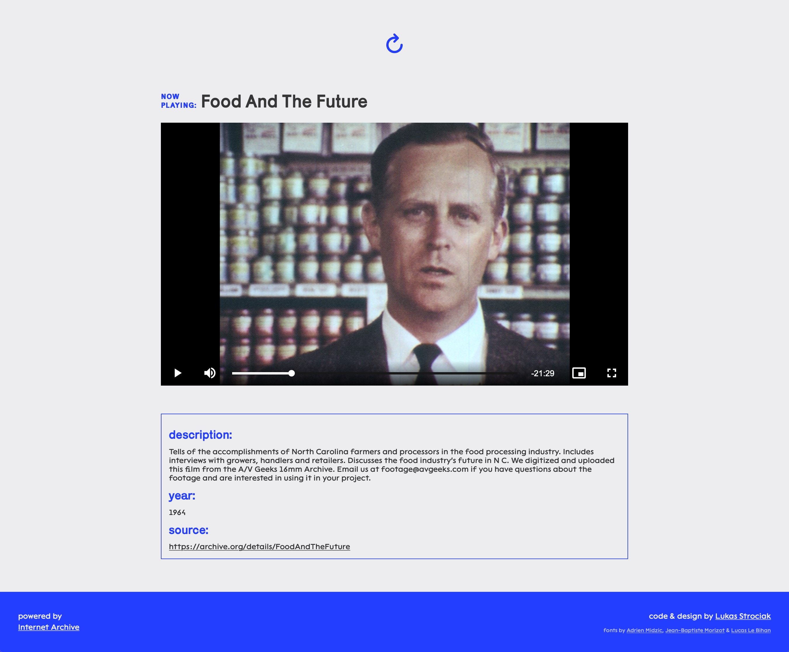

# Archive TV

## What is Archive TV?

Archive TV is a simple website that lets you explore the video library of Internet Archive, one random video at a time.

See it running live at https://archivetv.netlify.app/

### Project preview

## How does it work?

Upon entering the website fetches and loads a random item from the Internet Archive video library. You can hit a button to load a new video or just let it play and it will reload automatically on video end.

You can let it stay open and keep on playing forever, just like regular TV.

The items are chosen randomly from a pre-defined list of video collections to ensure a healthy variety of content.

The project is a very simple mix of HTML, CSS and Javascript and it uses Video.js for the video player.
